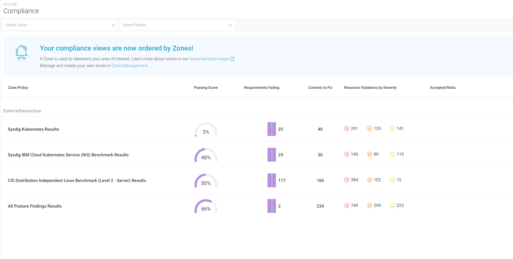

---

copyright:
  years:  2023, 2024
lastupdated: "2024-04-18"

keywords:

subcollection: workload-protection

---

{{site.data.keyword.attribute-definition-list}}

# Understanding your compliance posture
{: #compliance-understanding}

You can use the {{site.data.keyword.sysdigsecure_full}} UI to understand your environment's compliance posture.
{: shortdesc}

## Accessing the compliance overview view
{: #compliance-ui}

To access the **Compliance** overview view, do the following steps:

1. Open the [{{site.data.keyword.sysdigsecure_short}} UI](/docs/workload-protection?topic=workload-protection-launch).

2. Hover over the Posture icon  and click **Compliance**.

The compliance posture for each of your [zones](/docs/workload-protection?topic=workload-protection-posture-zones) is displayed.

{: caption="Example compliance view" caption-side="bottom"}

Zones are listed alphabetically. The default _Entire Infrastructure_ zone is automatically created by {{site.data.keyword.sysdigsecure_full_notm}}. You can define your own zones by using the [Zones page](/docs/workload-protection?topic=workload-protection-posture-zones).

Compliance posture information that is displayed includes:

Zone/Policy
:   Indicates the zones where policies have been defined in your environment.

Passing Score
:   Indicates the percentage of policy requirements that are passing. The higher the percentage, the more compliant your system is.

Requirements Failing
:   Indicates the number of policy requirements that need to be fixed to get the passing score to 100%. These are displayed as a bar chart displaying the results from the last 7 days. Requirements consist of one or more controls.

Controls to Fix
:   Indicates the number of controls that need to be remediated to achieve a 100% passing score.

    Multiple controls comprise a single requirement. So, the number of controls to fix will always be larger that the number of failing requirements.
    {: tip}

Resource Violations by Severity
:   Each control has a defined severity. This severity can be `high`, `medium`, or `low`. Resource violations by severity indicates the number of resources that are failing based on severity.

    One resource can have multiple controls and can be counted multiple times; once for each failing control.
    {: note}

Accepted Risks
:   Indicates the controls that have been evaluated as `accepted`.

    One control can affect multiple resources, so a number of resources can display the same controls as accepted risks.
    {: note}

## Reviewing details
{: #compliance-details}

You can see more information about a zone or policy by clicking the row. A **Results** page is displayed with the compliance details.

### Filtering details
{: #details-filter}

By default the top 50 results are displayed with the highest number of failures by severity displayed first. You can filter the results to see additional controls or to limit the displayed data.

You can filter the view by the zones and policies, types of findings and even by individual requirements or controls. The view can also be filtered to show failing controls by severity (`high`, `medium`, and `low`).

### Reviewing the control plane
{: #compliance-cp}

From the details page you can click on a requirement or control to see the subrequirements and controls that make up the requirement or control. Each item indicates whether it is passing or failing. If even one subrequirement or control is failing, the overall requirement or control is marked as failing.

To see the details of a subsection, click the row. The details for that control including the number and types of resources that are passing, failing, or have temporary accepted exceptions are displayed.

The resources can be filtered by the following:

Kubernetes identity
:   Valid filters are `cluster`, `name`, and `namespaceType`. An example `namespaceType` would be a `Group`, `ServiceAccount`, or `User`.

Kubernetes resource
:   Valid filters are `cluster`, `labels`, `name`, `namespace`, and `Type`. An example `Type` would be `Deplyment`, `Daemonset`, `StatefulSet`, `ReplicaSet`, `Pod`, or `ChronJobHost`.

Kubernetes, Linux, and Docker hosts
:   Valid filters are `cluster`, `name`, `OS` (operating system in inventory), `OSImage` (operating system doesn't exist in inventory).

You can also filter the view by failing control severity (`high`, `medium`, and `low`)

## Next steps
{: #understand-next}

The next steps are to [evaluate and remediate](/docs/workload-protection?topic=workload-protection-evaluate-remediate) the findings.
